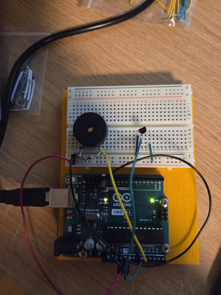
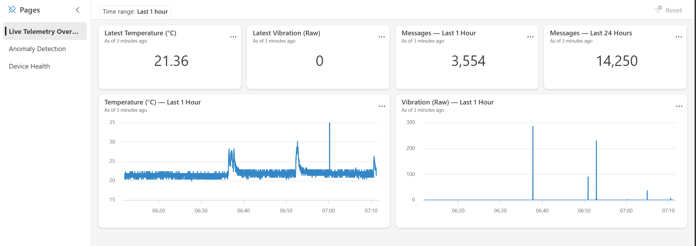
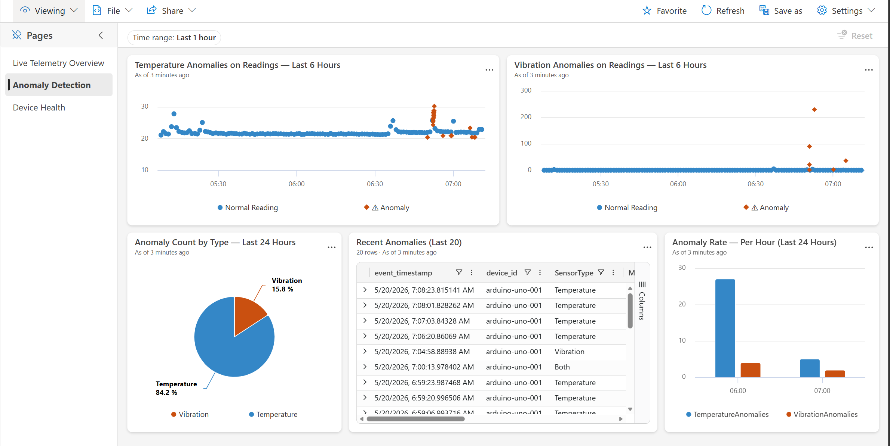
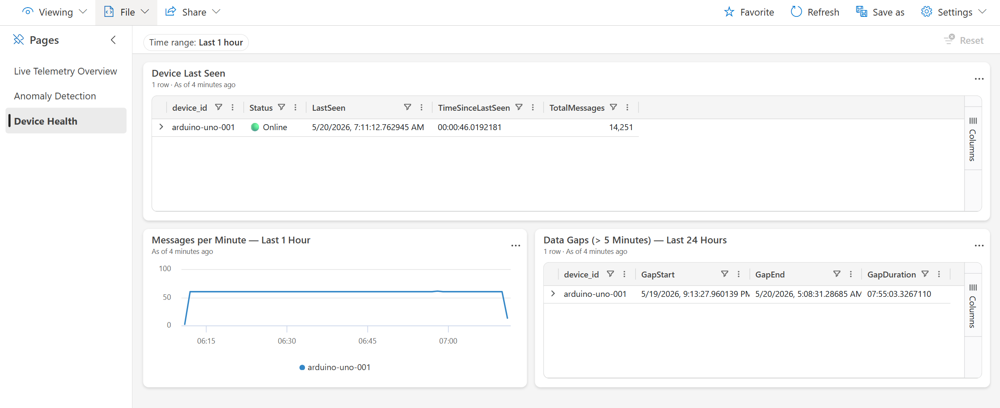
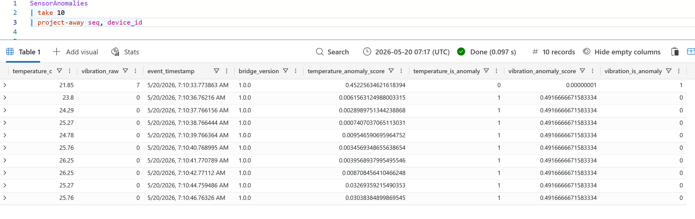
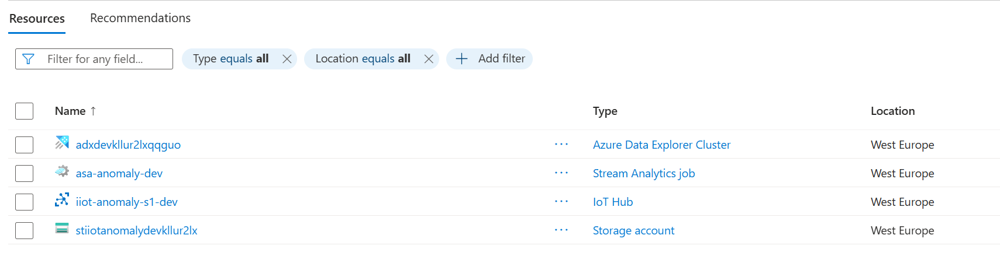

# IoT Telemetry and Anomaly Detection Pipeline

End-to-end telemetry system that collects sensor data from physical hardware, ships it through a cloud ingestion and stream-processing pipeline, applies real-time anomaly detection, and surfaces the results through dashboards and alerts — with full observability across every stage.

## Overview

This project demonstrates the design and implementation of a production-grade telemetry architecture spanning hardware sensors, edge-to-cloud data transport, stream analytics, and operational observability. It mirrors the challenges found in lab instrumentation and equipment monitoring environments: high-volume time-series ingestion, schema evolution, late/out-of-order data, device lifecycle management, and end-to-end diagnostic traceability.

### What this system does

1. **Acquires telemetry** from physical sensors (temperature, vibration) via Arduino hardware
2. **Transports** readings to the cloud through a Python bridge process with structured logging
3. **Processes streams** in real time — transformations, windowed aggregations, anomaly detection
4. **Persists** raw data (for replay/reprocessing) and curated results (for querying)
5. **Enables observability** — correlated logs, platform metrics, alerts, and dashboards

## Architecture

See [`docs/architecture.mmd`](docs/architecture.mmd) for the full Mermaid diagram.

```
Sensors (TMP36, Piezo)
    |  serial JSON
Host PC (Python bridge — async I/O, structured logging)
    |  HTTPS / AMQP
Azure IoT Hub
    |                       |
    |  event stream          |  direct ingestion
    v                       v
Azure Stream Analytics   Azure Data Explorer (SensorReadings)
    |                |
    |  raw archive   |  anomaly output
    v                v
ADLS Gen2          ADX (SensorAnomalies)
                        |  KQL queries
                   ADX Dashboard
```

**Observability layer** (spans full pipeline):
- Azure Monitor — platform metrics from IoT Hub and Stream Analytics
- Application Insights / OpenTelemetry — traces and logs from the Python bridge

> In a production deployment, this extends to custom ML models, alert-driven automation, and downstream processing services. See [Observability Model](#observability-model) below.

## Demo

<video src="https://github.com/LizaMalinina/industrial-iot-anomaly-pipeline/raw/master/docs/screenshots/demo-dashboard.mp4" controls width="100%">
  Your browser does not support the video tag. <a href="docs/screenshots/demo-dashboard.mp4">Download the demo</a>.
</video>

*Dashboard reacting to anomaly readings (temperature spike, vibration tap) and device going offline.*

## Screenshots

### Hardware Setup


*Arduino Uno R3 with TMP36 temperature sensor and piezo disc for vibration detection, connected via USB serial to the Python bridge.*

### Live Telemetry Dashboard


*Real-time temperature and vibration charts with stat cards showing latest readings and message throughput.*

### Anomaly Detection Dashboard


*Scatter charts overlay detected anomalies (orange ◆) on normal readings (blue ●). Pie chart shows anomaly distribution by type. Table lists the 20 most recent anomaly events with scores.*

### Device Health Dashboard


*Device status (🟢 Online), message throughput per minute, and data gap detection for the last 24 hours.*

### KQL Query — Anomaly Records


*SensorAnomalies table showing detected temperature spikes with anomaly scores from the AnomalyDetection_SpikeAndDip function.*

### Azure Resource Group


*All deployed Azure resources: ADX cluster, Stream Analytics job, IoT Hub (S1), and Storage account — all in West Europe.*

## Key Design Decisions

| Decision | Rationale |
|----------|-----------|
| Physical hardware, not simulated | Demonstrates hands-on device-to-cloud integration and debugging of real communication issues |
| Python bridge with async I/O | Decouples device protocol from cloud transport; enables local buffering, retry logic, and structured logging |
| Dual storage layers (raw + curated) | Raw archive enables replay and reprocessing; curated layer supports efficient time-series queries |
| Schema-flexible ingestion | JSON payloads with versioning; tolerant of firmware changes; dead-letter routing for unrecognized schemas |
| Built-in anomaly detection (ASA) | Operationally simple; extensible to custom ML models without pipeline changes |
| Infrastructure as Code (Bicep) | Reproducible deployments; environment isolation; self-documenting infrastructure |

## Observability Model

### Telemetry Taxonomy

| Category | Examples | Destination |
|----------|----------|-------------|
| Device telemetry | Sensor readings, sequence numbers, device health | IoT Hub → ADX (direct) + ASA → Storage |
| Pipeline metrics | Message throughput, ingestion latency, dropped events | Azure Monitor |
| Application traces | Bridge processing time, anomaly events | Application Insights |
| Operational alerts | Device offline, latency threshold breach, anomaly spike | Azure Monitor Alerts |

### End-to-End Correlation

Every telemetry message carries a `device_id` and monotonic `seq` number. The bridge enriches with a UTC timestamp and correlation metadata, enabling tracing of a single reading from sensor through storage and into dashboard rendering.

### Diagnostics and Debugging

The system is designed to answer questions like:
- Why did Device X stop reporting at time T?
- What was the end-to-end latency for the last 1000 messages?
- Which readings triggered anomaly detection, and what was the surrounding context?
- Did a firmware update change the telemetry schema, and are downstream consumers handling it?

## Tech Stack

| Layer | Technology |
|-------|-----------|
| Hardware | Arduino Uno R3, TMP36 (temperature), Piezo (vibration) |
| Bridge | Python 3.13, pyserial, azure-iot-device, async I/O |
| Ingestion | Azure IoT Hub |
| Stream Processing | Azure Stream Analytics |
| Storage (raw) | Azure Data Lake Storage Gen2 |
| Storage (curated) | Azure Data Explorer (Kusto / KQL) |
| Visualization | Azure Data Explorer Dashboards (native KQL) |
| Observability | Azure Monitor, Application Insights, OpenTelemetry |
| Infrastructure | Bicep (modular, parameterized) |
| Testing | pytest, pytest-asyncio |

## Repository Structure

```
device/         Arduino firmware — reads sensors, outputs JSON over serial
bridge/         Python serial-to-cloud forwarder (tested, async)
  tests/        Unit tests (parser, validator, forwarder)
infra/          Bicep modules and deployment scripts
  modules/      IoT Hub, Storage, ADX, Stream Analytics
stream-jobs/    Stream Analytics query definitions
dashboards/     ADX dashboard export (importable JSON) and KQL queries reference
docs/           Architecture diagrams, hardware setup guide, design notes
```

## Getting Started

### Prerequisites

- Arduino Uno R3 with TMP36 and Piezo sensors (see [`docs/hardware-setup.md`](docs/hardware-setup.md))
- Python 3.10+
- Azure subscription
- Azure CLI with Bicep

### 1. Deploy infrastructure

```powershell
cd infra
./deploy.ps1 -EnvironmentName dev -Location westeurope
```

### 2. Wire and flash the Arduino

Follow [`docs/hardware-setup.md`](docs/hardware-setup.md) for wiring, component details, and validation steps.

### 3. Run tests

```powershell
python -m pytest bridge/tests/ -v
```

### 4. Run the bridge

```powershell
pip install -r bridge/requirements.txt
$env:IOT_HUB_CONNECTION_STRING = "<from deployment output>"
$env:SERIAL_PORT = "COM3"
python -m bridge.bridge
```

## Reliability Considerations

| Concern | Approach |
|---------|----------|
| Device offline / intermittent | Bridge buffers locally; IoT Hub retains messages; alerts on silence |
| Out-of-order / late data | Event-time processing in ASA with watermarking and late arrival tolerance |
| Schema evolution | Schemaless raw archive; flexible curated schema; dead-letter for unrecognized payloads |
| Processing failures | At-least-once delivery; idempotent writes; raw data enables full replay |
| Scalability | IoT Hub partitions by device; ASA scales via Streaming Units; serverless compute |
