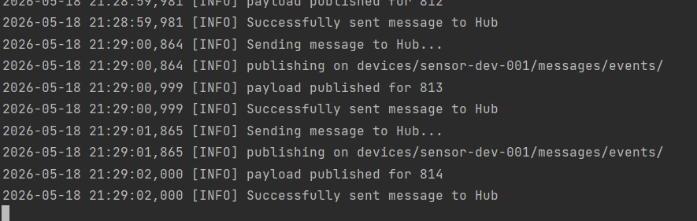

# Bridge — Serial-to-Azure IoT Hub Forwarder

Reads JSON telemetry from Arduino over USB serial and forwards it to Azure IoT Hub.

## Setup

```bash
pip install -r requirements.txt
```

## Configuration

Set environment variables:
```bash
IOT_HUB_CONNECTION_STRING=HostName=<hub>.azure-devices.net;DeviceId=<id>;SharedAccessKey=<key>
SERIAL_PORT=COM3          # Windows — check Device Manager
SERIAL_BAUD=9600
```

## Run

All commands should be run from the **repository root**, not from inside the `bridge/` folder. This avoids Python import conflicts with standard library modules.

```powershell
python -m bridge.bridge
```

### Example Output



The bridge logs each message as it is published to IoT Hub, including the device path and sequence number.

## Test (without hardware)

From the repository root:

```powershell
python -m pytest bridge/tests/ -v
```
