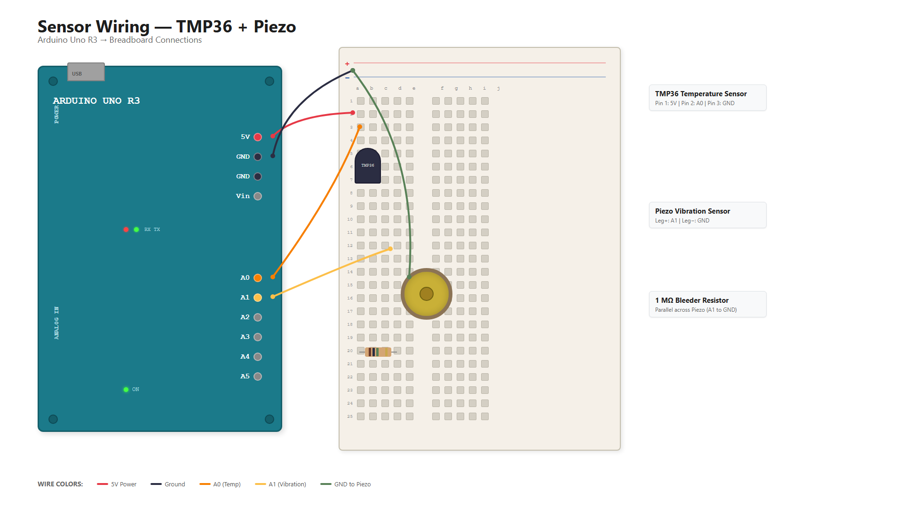

# Hardware Setup Guide

Wiring and validation instructions for the Arduino Uno R3 sensor station
(TMP36 temperature sensor + Piezo vibration sensor).



---

## Bill of Materials

| # | Component | Notes |
|---|-----------|-------|
| 1 | Arduino Uno R3 | Microcontroller board |
| 2 | USB-B cable | Power and serial data link to host PC |
| 3 | TMP36 temperature sensor | Analog output, 10 mV/°C |
| 4 | Piezo element (disc or buzzer) | Used as vibration/knock sensor |
| 5 | 1 MΩ resistor (brown-black-green-gold) | Bleeder resistor for piezo ADC input |
| 6 | Breadboard | Solderless prototyping |
| 7 | Jumper wires (male-male, x6 minimum) | Signal and power connections |

All components are included in a standard Arduino starter kit.

---

## Pin Assignments

| Arduino Pin | Connected To | Purpose |
|-------------|-------------|---------|
| 5V | TMP36 pin 1 (VCC) | Power for temp sensor |
| GND | TMP36 pin 3, Piezo leg 2 | Common ground |
| A0 | TMP36 pin 2 (OUT) | Analog temperature reading |
| A1 | Piezo leg 1 | Analog vibration reading |

---

## Wiring Diagram (Mermaid)

See `docs/wiring-diagram.mmd` for a visual diagram. The schematic below shows the logical connections:

```
                    Arduino Uno R3
                 ┌─────────────────────┐
                 │                     │
    ┌────────────┤ 5V                  │
    │            │                     │
    │  ┌─────────┤ GND                 │
    │  │         │                     │
    │  │    ┌────┤ A0                  │
    │  │    │    │                     │
    │  │    │  ┌─┤ A1                  │
    │  │    │  │ │                     │
    │  │    │  │ │              USB ◄──┼──── to PC
    │  │    │  │ │                     │
    │  │    │  │ └─────────────────────┘
    │  │    │  │
    │  │    │  │
    ▼  ▼    ▼  │         ┌─────────────────────┐
  ┌──────────┐ │         │     Piezo Element    │
  │  TMP36   │ │         │                      │
  │          │ │         │  ┌───┐    ┌───────┐  │
  │ 1  2  3  │ │         │  │ + │    │  1MΩ  │  │
  └─┬──┬──┬──┘ │         │  │leg│    │resistor│  │
    │  │  │    │         │  └─┬─┘    └───┬───┘  │
    │  │  │    │         │    │          │       │
    │  │  │    └─────────┼────┴──────────┘       │
    │  │  │              │         │              │
    │  │  └──── GND      │      GND bus          │
    │  └─────── A0       └─────────────────────── │
    └────────── 5V
```

---

## Detailed Wiring Instructions

### Step 1: Place the TMP36 on the Breadboard

The TMP36 has 3 pins. With the **flat side facing you** (text readable):

```
         ┌─────┐
         │TMP36│
         │     │
         └┬─┬─┬┘
          │ │ │
Pin 1    Pin 2  Pin 3
(VCC)   (OUT)  (GND)
```

1. Insert the TMP36 into the breadboard spanning 3 rows
2. **Pin 1 (left, VCC)** → connect to Arduino **5V** (red wire)
3. **Pin 2 (center, OUT)** → connect to Arduino **A0** (orange/yellow wire)
4. **Pin 3 (right, GND)** → connect to Arduino **GND** (black wire)

> **WARNING**: Do NOT reverse VCC and GND. The TMP36 will overheat and burn out
> within seconds if wired backwards. If the sensor becomes hot to touch, disconnect
> USB power immediately.

#### Why no resistor for TMP36?
The TMP36 outputs a voltage proportional to temperature (10mV/°C with 500mV offset at 0°C).
The Arduino's analog input has very high impedance (~100MΩ), so no voltage divider or
pull-up/pull-down resistor is needed. Direct connection is correct.

---

### Step 2: Wire the Piezo Element

The piezo disc/element generates voltage when flexed or struck (piezoelectric effect).
We use it as a **vibration sensor** (not a buzzer).

1. **Piezo leg 1 (often red wire or marked +)** → connect to Arduino **A1**
2. **Piezo leg 2 (often black wire)** → connect to **GND** rail

#### The 1 MΩ Bleeder Resistor (REQUIRED)

Connect a **1 MΩ (megaohm)** resistor **in parallel** across the piezo element
(between A1 and GND):

```
        A1 ─────┬──────────── Piezo leg 1 (+)
                │
           ┌────┴────┐
           │  1 MΩ   │
           │ resistor │
           └────┬────┘
                │
       GND ─────┴──────────── Piezo leg 2 (−)
```

**Why this resistor is needed:**
- The piezo generates a voltage spike on impact but has effectively infinite DC impedance
- Without the resistor, the charge builds up on the Arduino's ADC input capacitor and never drains
- This causes the reading to "stick" at a high value instead of returning to 0
- The 1 MΩ resistor bleeds off the charge slowly enough to not attenuate the signal,
  but fast enough that readings reset between samples

**Color bands for 1 MΩ resistor:**
- 4-band: Brown – Black – Green – Gold (±5%)
- 5-band: Brown – Black – Black – Yellow – Brown (±1%)

> **Note**: If you don't have 1 MΩ, any value in the 470 kΩ – 2.2 MΩ range will work.
> Lower values drain charge faster (lower peak reading). Higher values are more
> sensitive but reset more slowly between impacts.

---

### Step 3: Connect Power Rails

1. Connect Arduino **5V** to the breadboard **+ rail** (red wire)
2. Connect Arduino **GND** to the breadboard **− rail** (black wire)
3. Use the rails to distribute power to both sensors

---

### Step 4: Double-Check Before Powering On

**Pre-power checklist:**

- [ ] TMP36 flat side facing you: left=5V, center=A0, right=GND
- [ ] TMP36 is NOT reversed (will burn immediately if wrong)
- [ ] Piezo connected: one leg to A1, other leg to GND
- [ ] 1 MΩ resistor across piezo (A1 to GND)
- [ ] No loose wires touching each other
- [ ] USB cable connected to PC

---

## Upload & Test the Firmware

### Prerequisites
- [Arduino IDE](https://www.arduino.cc/en/software) installed (v2.x recommended)
- USB driver for Arduino Uno (usually auto-installed on Windows)

### Steps

1. Open `device/sensor_firmware.ino` in Arduino IDE
2. Select **Board**: `Arduino Uno` (Tools → Board → Arduino AVR Boards → Arduino Uno)
3. Select **Port**: the COM port that appeared when you plugged in the Arduino
   - Check in Device Manager → Ports (COM & LPT) → "Arduino Uno (COMx)"
4. Click **Upload** (→ arrow button)
5. Open **Serial Monitor** (Tools → Serial Monitor or Ctrl+Shift+M)
6. Set baud rate to **9600**

### Expected Output

You should see JSON lines once per second:

```json
# IoT Sensor Firmware v1.0 started
# Device: arduino-uno-001
{"device_id":"arduino-uno-001","seq":0,"temperature_c":22.45,"vibration_raw":0}
{"device_id":"arduino-uno-001","seq":1,"temperature_c":22.51,"vibration_raw":0}
{"device_id":"arduino-uno-001","seq":2,"temperature_c":22.48,"vibration_raw":3}
```

### Quick Validation Tests

| Test | Action | Expected Result |
|------|--------|-----------------|
| Temperature | Touch TMP36 with finger | `temperature_c` rises to ~30-35°C |
| Temperature | Hold ice near sensor | `temperature_c` drops below 20°C |
| Vibration | Tap the piezo disc | `vibration_raw` spikes (100-1023) |
| Vibration | Leave undisturbed | `vibration_raw` stays near 0 |
| Baseline | Room temp, no touch | ~20-25°C, vibration ~0-5 |

### Troubleshooting

| Problem | Cause | Fix |
|---------|-------|-----|
| No output in Serial Monitor | Wrong baud rate | Set to 9600 |
| `temperature_c` reads -40 or 0 | TMP36 not connected to A0 | Check center pin wire |
| `temperature_c` reads 100+ and rising | **TMP36 wired backwards!** | **UNPLUG IMMEDIATELY**, swap VCC/GND |
| `vibration_raw` stuck at high value | Missing bleeder resistor | Add 1 MΩ between A1 and GND |
| `vibration_raw` always 0 | Piezo not on A1, or broken | Check wiring, try tapping harder |
| Upload fails | Wrong COM port | Check Device Manager |

---

## Connecting to the Bridge (Phase 2)

Once the Serial Monitor shows correct data, you're ready to run the Python bridge:

```powershell
cd bridge
pip install -r requirements.txt

# Set your COM port (check Device Manager)
$env:SERIAL_PORT = "COM3"

# For now, test without Azure (just verify parsing):
python -c "
import serial
from bridge.parser import parse_serial_line, validate_telemetry

ser = serial.Serial('COM3', 9600, timeout=2)
for i in range(10):
    line = ser.readline().decode('utf-8', errors='replace')
    msg = parse_serial_line(line)
    if msg:
        valid = validate_telemetry(msg)
        print(f'Valid={valid}: {msg}')
ser.close()
"
```

Once Azure IoT Hub is deployed (see `infra/README.md`), set the connection string and run the full bridge:

```powershell
$env:IOT_HUB_CONNECTION_STRING = "HostName=..."
python -m bridge.bridge
```

---

## Safety Notes

- **TMP36 reversal**: If the sensor gets hot to touch, UNPLUG USB immediately. It means VCC and GND are swapped. The sensor may be damaged — test with a multimeter or replace.
- **Piezo voltage**: A hard strike on a large piezo can generate 50V+. The 1 MΩ resistor and the Arduino's internal clamping diodes protect the ADC, but avoid smashing the piezo with a hammer.
- **USB power**: The Arduino Uno provides up to ~400mA on the 5V rail from USB. Two small sensors use < 5mA total — no external power supply needed.
